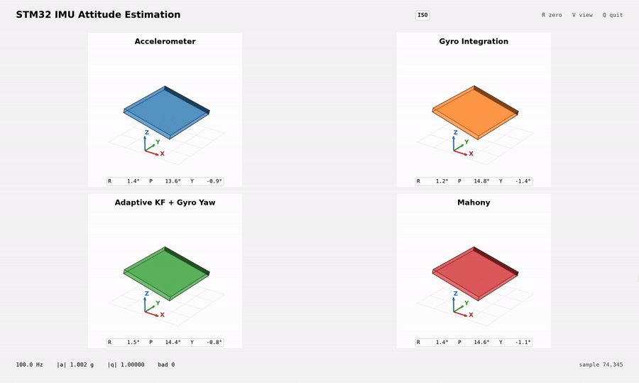
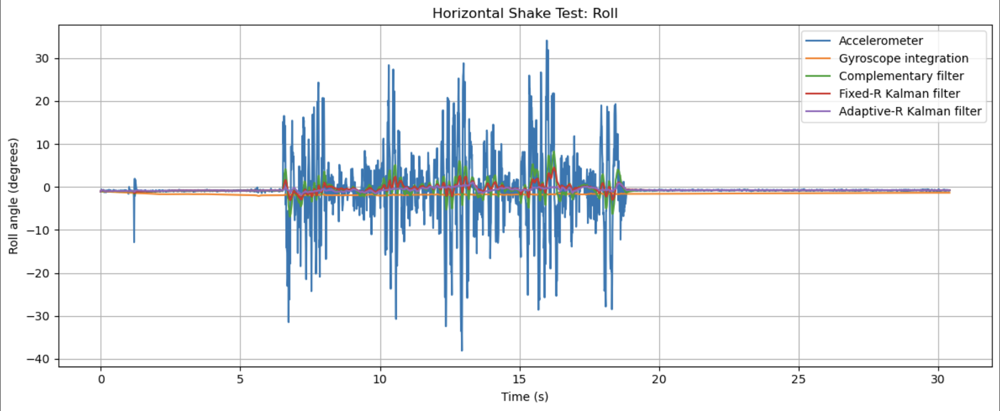
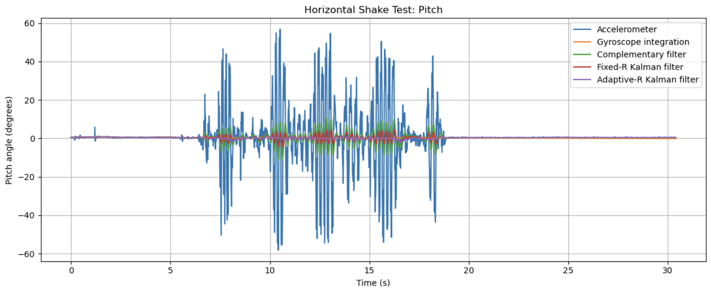
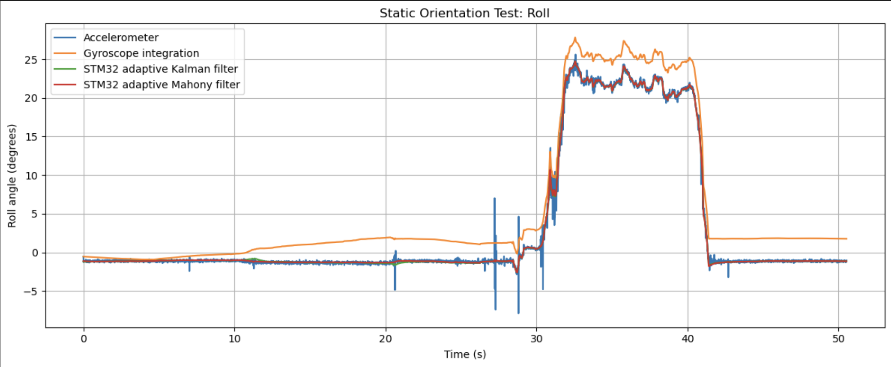
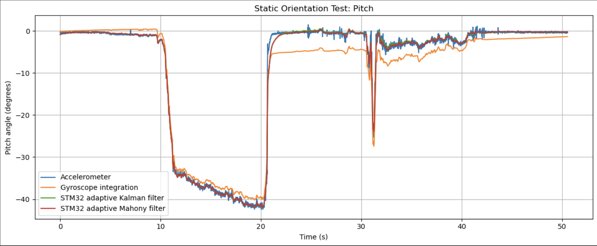

# STM32 IMU Orientation Estimation

A real-time embedded orientation-estimation system built on an STM32F446RE and MPU-6050. The system samples a six-axis IMU at 100 Hz, applies offline-derived sensor calibration, performs real-time attitude estimation on the microcontroller, and streams estimator outputs over UART to a live Python 3D visualization.

The project implements:

- Adaptive Kalman filtering for roll and pitch
- Quaternion-based Mahony filtering for 3D orientation, with gravity-referenced roll/pitch and gyro-derived yaw

## Demo

[](assets/dashboard_demo_compressed.mp4)

**[Watch the full live demo](assets/dashboard_demo_compressed.mp4)**

The dashboard visualizes four orientation estimates streamed from the STM32 in real time: accelerometer-derived tilt, gyro-only quaternion propagation, adaptive Kalman roll/pitch with gyro-derived yaw, and the Mahony quaternion estimate.

## System Overview

- STM32 Nucleo-F446RE
- MPU-6050 six-axis IMU
- Custom I²C sensor driver in C
- Timer-driven 100 Hz sampling
- Offline accelerometer and gyroscope calibration with corrections applied on-device
- Gyro-only quaternion integration
- Adaptive two-state Kalman filters with gyro-bias estimation
- Quaternion-based Mahony attitude estimation
- Acceleration-based rejection during dynamic motion
- UART telemetry at 460800 baud
- Python data logging, analysis, and live 3D visualization

## Architecture

```text
MPU-6050
    │
    │ I²C
    ▼
STM32F446RE
    ├── Calibration correction
    ├── 100 Hz sensor acquisition
    ├── Accelerometer tilt estimation
    ├── Gyro-only quaternion integration
    ├── Adaptive Kalman filters
    └── Mahony quaternion filter
    │
    │ UART
    ▼
Python
    ├── Data logging / analysis
    └── Live 3D visualization
```

## Embedded Implementation

The STM32F446RE performs sensor acquisition and attitude estimation in real time. A custom MPU-6050 driver built on the STM32 HAL configures the sensor over I²C, verifies communication through the `WHO_AM_I` register, and reads the accelerometer and gyroscope measurements. Offline-derived accelerometer bias/scale and gyroscope bias corrections are applied in the driver before measurements are passed to the estimators.

Sampling is driven by TIM2 at 100 Hz. The timer interrupt only sets a `sample_due` flag, while I²C communication, filtering, and UART transmission are handled in the main loop rather than inside the interrupt. This keeps the interrupt short while maintaining a deterministic 10 ms estimator update period.

For each sample, the firmware:

1. Reads and calibrates the six-axis IMU measurement
2. Computes gravity-based roll and pitch from the accelerometer
3. Updates a gyro-only quaternion estimate
4. Updates independent adaptive Kalman filters for roll and pitch
5. Updates a Mahony quaternion estimate using all three gyroscope axes and the measured gravity direction
6. Streams raw measurements, calibrated measurements, estimator states, and diagnostics over UART at 460800 baud

All orientation-estimation algorithms run directly on the STM32. Python is used only for logging, offline analysis, and visualization.

## State Estimation

The accelerometer and gyroscope provide complementary information about orientation. The gyroscope measures angular velocity accurately over short periods but accumulates drift when integrated over time. The accelerometer provides an absolute gravity reference for roll and pitch, but becomes unreliable during vibration and linear acceleration. The estimators combine these measurements to take advantage of both.

### Adaptive Kalman Filter

Independent two-state Kalman filters estimate roll and pitch. Each filter tracks the angle and gyroscope bias, using the bias-corrected gyro rate for prediction and the accelerometer-derived angle for correction.

The accelerometer measurement noise is adjusted dynamically using the measured acceleration magnitude. When the magnitude moves away from 1 g, indicating that the accelerometer may be sensing significant linear acceleration rather than gravity alone, its measurement covariance is increased. This reduces the Kalman gain and causes the filter to rely more heavily on the gyroscope until the accelerometer becomes reliable again.

### Mahony Quaternion Filter

A Mahony filter maintains the full 3D attitude as a unit quaternion. The quaternion is propagated using all three gyroscope axes, avoiding the geometric limitations of treating body-axis gyro rates as independent Euler-angle rates.

The accelerometer provides a gravity-direction reference. The filter compares the measured gravity direction with the direction predicted by the current quaternion and feeds the resulting orientation error back into the gyroscope rates before propagation. As with the Kalman filter, this correction is reduced when the measured acceleration magnitude departs from 1 g.

Because the system has no magnetometer or other external heading reference, gravity can correct roll and pitch but cannot determine absolute yaw. Yaw therefore remains gyro-derived and will gradually drift over time.

## Calibration and Validation

Sensor calibration was performed offline from recorded IMU data, with the resulting parameters applied to measurements on the STM32.

### Sensor Calibration

Accelerometer calibration used six stationary, axis-aligned captures (`+X`, `-X`, `+Y`, `-Y`, `+Z`, `-Z`) to estimate an independent bias and sensitivity for each axis. The calibration was then evaluated on a separate tilted stationary capture.

After correction, the independent test produced an acceleration magnitude of:

- **Mean:** 0.9958 g
- **Standard deviation:** 0.0020 g
- **Mean magnitude error:** ~0.42%

Gyroscope bias was estimated from a stationary capture and evaluated on a separate stationary dataset. The residual mean rates were approximately **0.015, 0.010, and -0.014 deg/s** on the X, Y, and Z axes, with stationary noise standard deviations of roughly **0.024–0.036 deg/s**.

### Estimator Validation

The orientation estimators were evaluated with three motion tests:

1. **Static orientation:** the IMU was rotated to several attitudes and held stationary to compare accelerometer, gyro, and fused estimates.
2. **Long hold:** the IMU was held stationary to expose accumulated gyroscope drift and verify long-term roll/pitch stability.
3. **Horizontal shake:** translational acceleration was introduced without a corresponding orientation change, intentionally violating the assumption that the accelerometer measures gravity alone.

The shake test was also used to tune the adaptive accelerometer rejection. Increasing the rejection gain reduced false attitude changes during translational acceleration without visibly degrading normal orientation tracking.

The selected gain of **10,000** reduced shake-test error compared with the fixed-measurement-noise Kalman filter:

| Estimator | Roll RMSE | Pitch RMSE |
|---|---:|---:|
| Fixed measurement noise | 1.200° | 1.316° |
| Adaptive rejection | **0.535°** | **0.616°** |

This corresponds to approximately a **55% reduction in roll RMSE** and **53% reduction in pitch RMSE** on the disturbance dataset used for tuning.

## Results and Visualization

The final system runs all orientation estimators on the STM32 at 100 Hz and streams their outputs to Python for analysis and visualization.

### Adaptive Filtering

The adaptive Kalman filter reduces its reliance on the accelerometer during periods of significant linear acceleration. In the horizontal-shake tuning test, this substantially reduced false roll and pitch excursions compared with a fixed-measurement-noise Kalman filter.

| Roll | Pitch |
|---|---|
|  |  |

### Orientation Tracking

Across controlled roll/pitch motions and stationary holds, the adaptive Kalman and Mahony estimates closely track one another while remaining substantially smoother than the accelerometer-only estimate. The Mahony filter additionally maintains orientation as a quaternion, allowing coupled 3D rotations to be represented without treating body-axis gyro rates as independent Euler-angle rates.

| Roll | Pitch |
|---|---|
|  |  |

### Live Visualization

A Python dashboard renders the orientation estimates streamed directly from the STM32 in real time. It displays four representations side-by-side:

1. Accelerometer-derived tilt
2. Gyro-only quaternion propagation
3. Adaptive Kalman roll/pitch with gyro-derived yaw
4. STM32 Mahony quaternion estimate

Python does not rerun the embedded orientation estimators. It acts as a telemetry, analysis, and visualization layer.

[](assets/dashboard_demo_compressed.mp4)

**[Watch the full dashboard demo](assets/dashboard_demo_compressed.mp4)**

## Limitations

This system uses only a six-axis accelerometer/gyroscope IMU, so it has no absolute heading reference. Gravity provides an observable reference for roll and pitch, but not yaw. As a result, yaw is derived from integrated gyroscope measurements and will drift over time.

The independent roll and pitch Kalman filters also use the approximation that the X- and Y-axis body rates correspond directly to roll and pitch rates. This works well for the moderate and primarily single-axis motions tested here, but is not a general model for strongly coupled 3D rotations. The Mahony implementation avoids this approximation by propagating the full quaternion.

Sensor calibration parameters were obtained offline and are fixed in firmware. IMU bias can vary with temperature, time, and power cycling, so additional startup or online bias estimation would improve robustness. The Kalman filters partially address this by estimating X- and Y-axis gyroscope bias online.

## Running the Project

### Firmware

1. Connect the MPU-6050 to the STM32 Nucleo-F446RE over I²C.
2. Open the STM32 project in STM32CubeIDE.
3. Build and flash the firmware to the Nucleo board.
4. The firmware begins sampling the IMU at 100 Hz and streams telemetry over USART2 at 460800 baud.

### Python

Install the analysis and visualization dependencies:

```bash
pip install numpy matplotlib pandas pyserial
```

Record telemetry to a CSV:

```bash
python logger.py
```

Launch the live orientation dashboard:

```bash
python live_orientation_dashboard.py
```

Set the appropriate serial port for the Nucleo board in the Python scripts before running them.